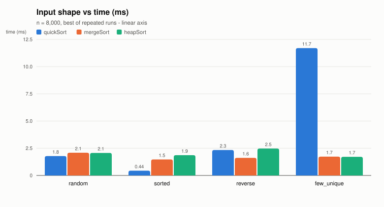
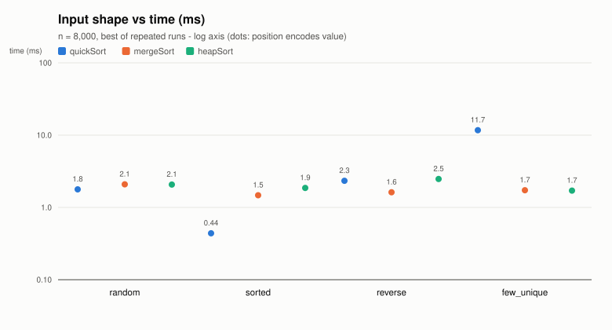
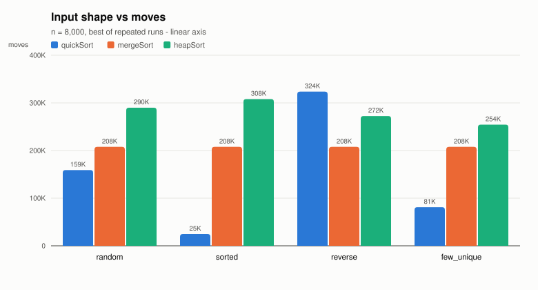
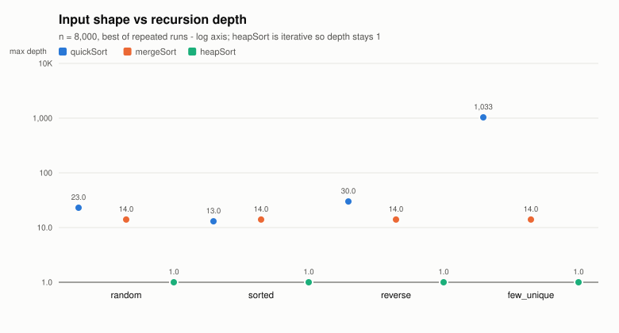
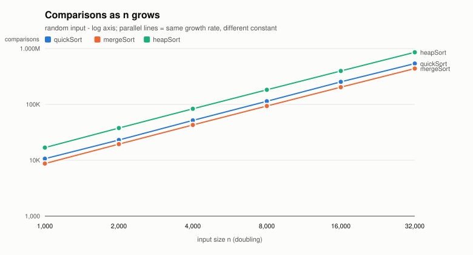
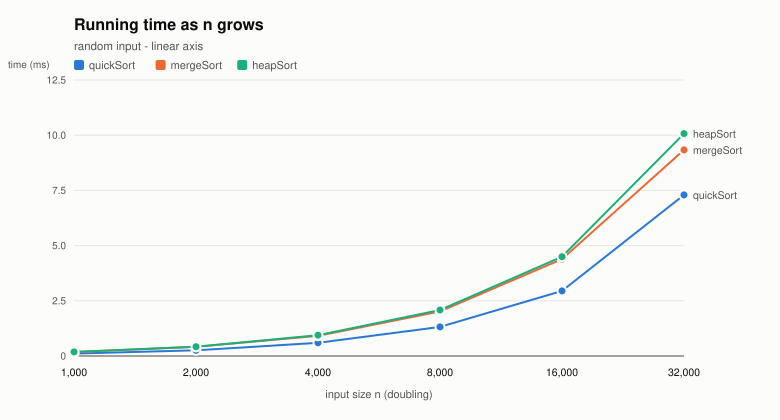
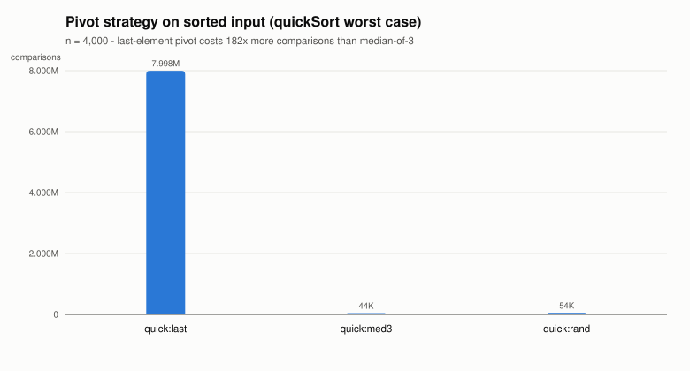

# 정렬 비교 보고서 — 퀵 · 병합 · 힙

고급알고리즘(SIT2001-01) 2026-2 과제 1

- 저장소: https://github.com/minje-602/algorithm-env-26-2-
- 구현: [`src/quickSort.c`](../src/quickSort.c) · [`src/mergeSort.c`](../src/mergeSort.c) · [`src/heapSort.c`](../src/heapSort.c) · [`src/sort.py`](../src/sort.py)
- 실행: `make run` (비교 표) · `make test` (유닛 테스트) · `make charts` (그래프) · `make crosscheck` (C·Python 대조)
- 환경: 컨테이너 안 gcc 14.2.0 (Debian 14.2.0-19), Python 3.13.5, `-std=c17 -Wall -Wextra -O2`

---

## 이 보고서의 주장

비교할 세 정렬은 평균 시간복잡도가 모두 O(n log n)으로 같다. 그런데 같은 등급에
놓여 있다고 해서 같은 물건인 것은 아니어서, 각자 서로 다른 것을 하나씩 내주고
그 자리에 올라와 있다.

| | 최악 시간 | 추가 공간 | 안정성 |
|---|---|---|---|
| 퀵 정렬 | **O(n²)** ✗ | O(log n) | ✗ |
| 병합 정렬 | O(n log n) | **O(n)** ✗ | ○ |
| 힙 정렬 | O(n log n) | O(1) | ✗ |

퀵은 최악의 경우 보장을 포기하고 평균 속도를 얻었고, 병합은 O(n)의 추가 공간을
내주고 보장과 안정성을 얻었으며, 힙은 공간과 보장을 둘 다 가져가는 대신 안정성과
실측 속도를 내주었다. **이 보고서가 하려는 일은 "무엇을 포기했는가"가 어떤 입력에서
실제로 드러나는지를 측정으로 확인하는 것이다.** 세 정렬을 나란히 놓고 숫자를
나열하는 것이 아니라, 각 숫자가 위 표의 어느 칸을 증명하는지를 따라간다.

미리 말해두면, 측정 과정에서 표에 적히지 않은 약점이 하나 더 드러났다. 퀵 정렬의
최악은 "정렬된 입력"만이 아니었다.

---

## 1. 코드 보고서

### 1.1 왜 인터페이스부터 만들었나

세 정렬을 각각 따로 부르면 측정 코드가 셋으로 갈라진다. 조건이 조금씩 어긋나면
비교 자체를 믿을 수 없게 되므로, **부르는 쪽이 정렬 이름을 한 번도 적지 않게**
만드는 것을 먼저 했다.

C에는 `interface`도 클래스도 없다. 대신 함수 포인터를 담은 구조체를 쓴다.

```c
/* src/sort.h */
typedef int (*SortCompare)(const void *a, const void *b);   /* qsort와 같은 규약 */

typedef struct SortAlgorithm {
    const char *name;
    const char *timeComplexity;
    const char *spaceComplexity;
    int stable;                  /* 안정 정렬이라고 "주장"하는 값 */
    void (*sort)(void *base, size_t n, size_t size,
                 SortCompare cmp, SortStats *stats);
} SortAlgorithm;
```

호출하는 쪽은 아래 표만 훑는다. 정렬을 하나 더 만들면 표에 한 줄 넣는 것으로 끝난다.

```c
/* src/sort.c */
const SortAlgorithm SORT_ALGORITHMS[] = {
    { "quickSort", "O(n log n)", "O(log n)", 0, quickSort },
    { "mergeSort", "O(n log n)", "O(n)",     1, mergeSort },
    { "heapSort",  "O(n log n)", "O(1)",     0, heapSort  },
};
```

#### 설계에서 고른 것

| 고민 | 고른 것 | 근거 |
| --- | --- | --- |
| 원소 타입 | `void *base` + `size_t size` | `int` 전용이면 **안정성을 잴 수 없다**. `3`과 `3`을 구별할 방법이 없기 때문이다 |
| 비교 | 함수 포인터 | 정렬을 고치지 않고 기준만 바꿀 수 있고, 비교 횟수가 정렬 바깥에서 세어진다 |
| 측정값 | `SortStats *` 인자 | 전역이면 정렬을 겹쳐 부를 수 없고 `NULL`로 측정을 끌 수도 없다 |
| 시간 | **인터페이스 밖**에서 잰다 | 정렬이 자기 시계를 들면 측정 방식이 구현마다 달라진다 |
| 복잡도·안정성 | 표에 **주장으로** 적는다 | 유닛 테스트가 실측과 맞춰 보아 거짓이면 실패시킨다 (→ 1.4) |

`void *`를 고른 것이 단순한 일반화가 아니라 **안정성 측정의 전제**라는 점이 중요하다.
정렬이 원소 타입을 모르기 때문에 원소를 `{key, tag}` 두 칸으로 만들어 넘길 수 있고,
그래야 정렬이 끝난 뒤 같은 `key`끼리 `tag` 순서가 보존되었는지 확인할 수 있다.

같은 수법을 출력에도 한 번 더 썼다. 측정은 한 번만 하고, 그 결과를 사람이 읽는 표로
찍을지 CSV로 찍을지만 함수 포인터(`RowSink`)로 갈아 끼운다. 덕분에 두 출력의 숫자가
어긋날 여지가 없고, 그래프 스크립트가 사람 읽는 표를 파싱하지 않아도 된다.

### 1.2 파일 구조

세 정렬은 작업 문맥(원소 크기 · 비교 함수 · 카운터 · 교환용 임시 칸)을 공유한다.
이것을 `sort.h`에 두면 `main.c`까지 정렬의 내장을 보게 되므로, **구현 전용 헤더**를
따로 두어 갈랐다.

| 파일 | 맡은 것 |
| --- | --- |
| `src/sort.h` | 바깥에 보이는 인터페이스 (`SortAlgorithm`, `SortStats`, `SortCompare`) |
| `src/sortctx.h` | `SortCtx`와 `sortSwap` 등 구현끼리만 쓰는 도구 |
| `src/sort.c` | 그 도구의 구현 + `SORT_ALGORITHMS` 표 |
| `src/quickSort.c` · `mergeSort.c` · `heapSort.c` | 알고리즘 하나씩 |
| `src/bench.c` | 입력 생성 · 시간 측정 · 정확성/안정성 판정 |
| `src/main.c` | 실험 수행. `--csv`를 주면 같은 측정을 CSV로 찍는다 |
| `src/sort.py` · `main.py` | 같은 알고리즘의 Python 구현 |
| `tests/test_sort.c` · `test_sort.py` | 유닛 테스트 |
| `tools/plot.py` | CSV → SVG 그래프. 표준 모듈만 쓴다 |
| `tools/crosscheck.py` | C·Python 카운터 대조 |

원소 타입을 모르므로 교환도 바이트 단위다. `sortSwap` 한 번이 **이동 3회**
(`tmp ← a`, `a ← b`, `b ← tmp`)이고, 이 규칙이 세 구현에 똑같이 적용된다.

### 1.3 왜 두 언어로 구현했나

저장소 규약(`AGENTS.md`)이 C와 Python 양쪽 구현을 요구한다. 다만 그것을 따르는 데는
규칙 준수 이상의 이유가 있었다.

**알고리즘이 하는 일의 양은 언어와 무관해야 한다.** 같은 입력에 대해 비교 횟수와
이동 횟수가 두 언어에서 같지 않다면, 둘 중 하나는 다른 알고리즘을 돌리고 있다는
뜻이다. 반대로 시간과 메모리는 언어에 종속된다. 그러니 두 구현의 카운터를 대조하면
**"알고리즘의 성질"과 "언어의 성질"을 실증적으로 갈라낼 수 있다.** 3.5절이 그 결과다.

### 1.4 검증

구현이 맞는지 어떻게 확인했는가. 테스트도 구현 표를 훑으므로, 정렬을 하나 더 넣으면
그 순간부터 같은 검사를 받는다.

```console
$ make test-c
30 checks, 0 failures
```

| 검사 | 내용 |
| --- | --- |
| 크기 훑기 | `n = 0..200`, 네 가지 입력 모양 전부에서 오름차순인가 |
| `qsort` 대조 | 독립적으로 구현된 표준 라이브러리 결과와 키 수열이 일치하는가 |
| 경계 조건 | 빈 배열 · 원소 1개 · 전부 같은 값 · `stats = NULL` |
| **주장 검증** | 표의 `stable` 값이 실측과 일치하는가 |
| 계측기 | 카운터가 오르는가, `extraBytes`·`maxDepth`가 주장과 맞는가 |
| 판정기 | 안정성 판정기 자체가 위반을 잡는가 |

**주장 검증에는 함정이 하나 있었다.** 안정성을 무작위 입력에서 재면, 중복 값이 거의
없어서 불안정한 정렬도 우연히 안정한 결과를 낸다. 실제로 `n = 2000` 무작위 입력에서
퀵 정렬이 안정한 결과를 냈다(3.3절 실험의 원자료 `results.csv`의
`growth,quickSort,random,2000` 행, `stable = 1`). 불안정하다는 것은 "항상
보존한다는 보장이 없다"는 뜻이지 "반드시 깨진다"가 아니므로 이것은 모순이 아니지만,
그대로 두면 멀쩡한 테스트가 실패한다. 그래서 **안정성 검증은 중복이 많은 입력에서만**
수행한다. 성질이 실제로 드러나는 조건을 골라 주지 않으면 측정이 운을 재게 된다.

같은 이유로 측정 결과 표에는 **판정 불가(`-`)** 를 따로 둔다. 중복이 하나도 없는
입력에서는 안정성 검사가 무조건 통과하므로, 그 통과를 "안정적"이라고 읽으면 거짓이 된다.

#### 테스트가 실제로 잡는지 — 변이 테스트

통과하는 테스트는 그 자체로는 아무것도 증명하지 않는다. 아무것도 검사하지 않는
테스트도 0 failures를 낸다. 그래서 구현을 일부러 망가뜨려 보았다.

| 망가뜨린 곳 | 결과 |
| --- | --- |
| 병합 정렬의 `<=` → `<` (안정성만 깨짐) | **30개 중 1개 실패** — 안정성 주장 검증 |
| 힙 정렬에서 큰 자식 → 작은 자식 (힙 성질이 깨짐) | 정확성 검사들이 함께 실패 |

첫째 변이가 이 절의 요점이다. `<`로 바꾸어도 **출력은 여전히 완벽한 오름차순**이라
정확성 검사도, `qsort` 대조도, 경계 조건도, 계측기 검사도 전부 통과한다. 오직 같은
값끼리의 원래 순서만 조용히 뒤집힌다. 30개 중 정확히 1개만 실패했다는 것은 **그 검사가
나머지 29개로 대체될 수 없다**는 뜻이고, 안정성 검사가 없었다면 이 버그는 드러나지
않았을 것이다.

#### 경고를 사람이 아니라 빌드가 확인하게

`AGENTS.md`는 경고 없이 빌드될 것을 요구한다. 그런데 `-Wall -Wextra`만 걸고
`gcc ... && echo "경고 없음"` 식으로 확인하면 소용이 없다. 경고는 컴파일을 실패시키지
않아 종료 코드가 0이므로, 경고가 떠 있어도 "경고 없음"이 찍힌다. 실제로 작업 중에 이
방식으로 `-Wcomment` 경고를 놓쳤다.

그래서 검사에는 `-Werror`를 붙였다. 경고를 에러로 승격시키면 하나라도 있는 한 빌드
자체가 실패하므로, **주장을 사람의 눈이 아니라 빌드 시스템이 강제한다.** 레지스트리의
`stable` 주장을 테스트가 검증하게 만든 것과 같은 발상이다.

#### 메모리 오류와 미정의 동작 — ASan · UBSan

원소 타입을 모르므로 `base + i * size` 같은 바이트 단위 포인터 산술과 `memcpy`를 쓴다.
이런 코드는 범위를 벗어나 읽어도 결과가 우연히 맞게 나올 수 있어서, 테스트 통과만으로는
안전하다고 말할 수 없다. 그래서 AddressSanitizer와 UndefinedBehaviorSanitizer를 붙여
유닛 테스트와 전체 실험을 한 번씩 돌렸다.

```sh
gcc -std=c17 -Wall -Wextra -g -O1 -fsanitize=address,undefined -fno-sanitize-recover=all \
    -Isrc -o asan.out tests/test_sort.c src/sort.c src/quickSort.c \
    src/mergeSort.c src/heapSort.c src/bench.c && ./asan.out
```

테스트는 30 checks 0 failures, 전체 실험(`src/main.c`)은 종료 코드 0에 진단 메시지
0줄이었다. `-fno-sanitize-recover=all`은 문제가 한 번이라도 나오면 경고만 찍고 넘어가지
않고 그 자리에서 멈추게 하는 옵션이다.

---

## 2. 알고리즘 상세

### 2.1 퀵 정렬 — 값으로 나눈다

나누는 데서 일을 다 하고 합칠 때는 아무것도 하지 않는다. 파티션이 피벗보다 작은 것을
왼쪽, 큰 것을 오른쪽으로 몰아 피벗을 최종 위치에 놓으면, 그 자리는 두 번 다시
건드리지 않는다.

```c
/* src/quickSort.c - Lomuto 파티션 */
static size_t partition(const SortCtx *c, size_t lo, size_t hi)
{
    size_t i = lo;                       /* 작다고 확정된 구간의 다음 빈 자리 */
    for (size_t j = lo; j < hi; j++) {
        if (sortCompareAt(c, j, hi) < 0) {
            sortSwap(c, i, j);
            i++;
        }
    }
    sortSwap(c, i, hi);
    return i;
}
```

교과서는 `i = lo - 1`로 시작하지만 `size_t`는 부호가 없어 `lo`가 0이면 그 자리에서
거대한 수로 되돌아간다. `i`의 의미를 "마지막 자리"에서 "다음 빈 자리"로 한 칸 옮겨
피했다.

**얼마나 균등하게 갈리느냐가 피벗 선택에 달려 있다.** 그래서 파티션 로직은 한 벌만
두고 피벗 전략만 갈아끼울 수 있게 했다. 그래야 실험이 재는 것이 순수하게 전략의
효과가 된다.

주의 깊게 볼 곳이 하나 더 있다. 비교가 `< 0`, 즉 **엄격한 부등호**이므로 피벗과 값이
**같은** 원소는 모두 오른쪽에 남는다. 이 한 글자가 3.2절에서 드러날 두 번째 최악의
원인이 된다.

### 2.2 병합 정렬 — 위치로 나눈다

퀵과 정확히 반대의 시소다. 분할은 공짜(인덱스 한가운데를 자른다)이고 합치는 데서
일을 한다. 어떤 입력이 와도 정확히 절반으로 갈리므로 재귀 깊이가 log n으로 고정되고,
최악의 경우에도 O(n log n)이 보장된다. 그 대가가 O(n) 임시 배열이다.

```c
/* src/mergeSort.c */
if (sortCompareAt(c, i, j) <= 0) {   /* '<' 이면 안정성이 깨진다 */
    sortMove(c, buf + k * c->size, sortElemAt(c, i));
    i++;
}
```

`<=`가 안정성의 핵심이다. 값이 같으면 왼쪽(먼저 들어온 쪽)을 먼저 내보낸다. 1.4절의
변이 테스트가 겨눈 것이 바로 이 한 글자다.

분할 지점은 `mid = lo + (hi - lo) / 2`로 계산한다. `(lo + hi) / 2`는 인덱스가 클 때
덧셈이 넘칠 수 있는데, 구간 길이를 절반 낸 뒤 `lo`에 더하면 그 위험이 없다.

버퍼는 맨 위에서 한 번만 잡아 재귀에 물려 내려보낸다. `mergeRuns` 안에서 매번 잡으면
호출이 O(n)번이라 할당 비용이 알고리즘 비용을 덮어버리기 때문이다.

### 2.3 힙 정렬 — 배우지 않은 정렬

> 이 절은 과제 요구사항인 "배우지 않은 정렬을 AI를 통해 학습한 내용"에 해당한다.
> 전체 학습 정리는 [`heapsort-study.md`](heapsort-study.md)에 따로 두었고, 여기에는
> 구현과 실험에 직접 필요한 부분만 옮긴다. 복잡도·역사에 관한 서술은 위키피디아
> [Heapsort](https://en.wikipedia.org/wiki/Heapsort) 문서와 대조했으며, 검증 가능한
> 주장은 직접 측정해 확인했다.

**힙 정렬은 선택 정렬에서 "최대값 찾기"만 바꾼 정렬이다.** 선택 정렬은 남은 구간을
훑어 최대값을 찾으므로 한 번에 O(n)이 들고, 이를 n번 반복해 O(n²)이 된다. 이 구조에서
바꿀 수 있는 곳은 한 군데뿐이다 — 최대값을 더 빨리 찾을 수 있다면?

힙 정렬의 답은 배열을 최대 힙으로 유지하는 것이다. 그러면 최대값은 항상 맨 앞에 있고,
하나를 빼낸 뒤 복구하는 데 O(log n)이면 된다. O(n)이 O(log n)이 되니 전체가
O(n log n)으로 내려간다. 새로운 발상이라기보다 **선택 정렬의 병목에 적절한 자료구조를
끼워 넣은 결과**로 보는 편이 정확하다.

힙은 별도의 자료구조가 아니라 **배열을 트리로 읽는 약속**이다. 인덱스 `i`의 자식은
`2i+1`과 `2i+2`이고, 조건은 "모든 부모는 자식보다 크거나 같다" 하나뿐이다. 정렬보다
약한 조건이라 유지 비용이 싸고, 포인터도 노드 객체도 없어 추가 메모리가 들지 않는다.

```c
/* src/heapSort.c */
static void siftDown(const SortCtx *c, size_t root, size_t n)
{
    while (2 * root + 1 < n) {
        size_t child = 2 * root + 1;
        if (child + 1 < n && sortCompareAt(c, child, child + 1) < 0)
            child++;                                  /* 큰 자식을 고른다 */
        if (sortCompareAt(c, root, child) >= 0) return;
        sortSwap(c, root, child);
        root = child;
    }
}
```

작은 자식과 바꾸면 올라간 값이 반대편 자식보다 작아져 힙 성질이 다시 깨진다. 그리고
`siftDown`을 **반복문으로** 쓴 것은 취향이 아니다. 재귀로 쓰면 호출 스택이 O(log n)
쌓여 레지스트리에 적은 `"O(1)"` 주장이 거짓이 되고, `maxDepth` 카운터가 그 거짓말을
그대로 드러낸다.

**힙 구성이 O(n)인 이유.** 직관적으로는 "n/2개 노드 각각에 O(log n)이니 O(n log n)"
같지만 실제로는 O(n)이다. 높이 h인 노드는 최대 `n/2^(h+1)`개이고 작업량은 O(h)이므로
전체는 `(n/2)·Σ h/2^h`인데, 이 급수가 2로 수렴하기 때문이다. 잎에 가까운 절반은 아예
움직이지 않고, 그 위 1/4은 많아야 한 칸 내려간다.

**비교 횟수가 병합의 약 두 배인 이유.** `siftDown`은 레벨당 비교를 2회 한다 — 자식끼리
한 번, 부모-자식 한 번. 깊이가 log n이므로 한 번 호출에 약 `2 log n`회, 전체로는
약 `2n log₂n`회다. 병합 정렬이 약 `n log₂n - n`회이므로 대략 두 배가 된다. 같은
O(n log n)이라도 **상수가 다르다**는 뜻이고, 이것이 점근 표기가 감추는 정보다.
3.2절에서 실측으로 확인한다.

**왜 불안정한가.** 최소 반례가 `n = 2`다. 입력 `[(1,a), (1,b)]`가 `[(1,b), (1,a)]`로
나온다. 원인은 2단계의 `swap(a[0], a[end])`가 값이 같은지 따지지 않는 **무조건 교환**
이기 때문이다. `n = 2`면 힙 구성 단계에서 아무 일도 일어나지 않고, 정렬 단계의 첫
교환이 그대로 두 원소를 뒤집는다. 이를 고치려면 각 원소에 원래 인덱스를 덧붙여야
하는데 그러면 O(n) 추가 공간이 필요해지므로, **안정성과 제자리성을 동시에 갖기 어렵다**는
트레이드오프가 여기서 드러난다.

---

## 3. 실험

### 3.1 무엇을 어떻게 쟀나

| 재는 것 | 방법 | 주의 |
| --- | --- | --- |
| 시간 | `clock()`, 배열 복사를 뺀 구간, 5회 중 **최솟값** | 기계·부하에 흔들린다. 같은 표 안에서만 견줄 것 |
| 비교 · 이동 | 구현이 `SortStats`에 센다 (교환 = 이동 3회) | 입력이 고정이면 언제 돌려도 같은 값이다 |
| 추가 메모리 | `extraBytes` — 입력 배열 밖에 잡은 바이트 | |
| 재귀 깊이 | `maxDepth` — 실제로 들어간 최대 깊이 | 스택 사용량의 대리 지표 |
| 안정성 | `tag` 순서 실측, 중복 없으면 판정 불가(`-`) | 표의 `stable` 값은 **주장**일 뿐이다 |

평균이 아니라 최솟값을 쓴 이유는, 방해는 시간을 늘리기만 하고 줄이지는 않기 때문이다.
가장 빠른 실행이 알고리즘 고유 비용에 가장 가깝다.

입력은 네 모양으로 만들고(무작위 · 정렬됨 · 역순 · 중복많음) 씨앗을 고정해 매번 같은
배열을 쓴다. 무작위 피벗도 같은 시드를 쓰므로 실험 전체가 재현된다.

#### 축을 두 벌 그린 이유

그래프는 같은 자료를 선형 축과 로그 축으로 한 벌씩 만들었다(`make charts`, `report/` 아래
11개). 하나로는 절반씩 놓치기 때문이다. 쪽수 제한 때문에 보고서에는 두 축의 차이가 가장
잘 드러나는 시간 그래프만 두 벌을 싣고, 나머지는 한 벌씩만 실었다.

| 축 | 잘 보여 주는 것 | 감추는 것 |
| --- | --- | --- |
| 선형 | 격차의 **크기**. 막대 길이가 곧 값의 비율이다 | 작은 값. 바닥에 붙어 사라진다 |
| 로그 | 작은 값과 **자라는 속도** | 격차의 크기. 눈금 한 칸이 10배다 |

로그 축에서는 막대 대신 **점**을 썼다. 막대는 길이가 값을 뜻하는데 로그 축에서는
길이의 비가 값의 비와 달라져 눈을 속인다. 점은 위치만으로 값을 나타내므로 로그
축에서도 정직하다.

### 3.2 입력 모양별 (n = 8,000)

| 입력 | 알고리즘 | 시간(ms) | 비교 | 이동 | 깊이 | 추가(B) | 안정성 |
| --- | --- | ---: | ---: | ---: | ---: | ---: | :---: |
| 무작위 | quickSort | 1.778 | 113,833 | 158,994 | 23 | 8 | N |
| 무작위 | mergeSort | 2.086 | 93,720 | 207,616 | 14 | 64,008 | Y |
| 무작위 | heapSort | 2.072 | 182,779 | 289,830 | 1 | 8 | N |
| 정렬됨 | quickSort | 0.439 | 96,012 | 24,570 | 13 | 8 | - |
| 정렬됨 | mergeSort | 1.473 | 52,352 | 207,616 | 14 | 64,008 | - |
| 정렬됨 | heapSort | 1.861 | 189,377 | 307,914 | 1 | 8 | - |
| 역순 | quickSort | 2.338 | 185,505 | 323,664 | 30 | 8 | - |
| 역순 | mergeSort | 1.619 | 51,456 | 207,616 | 14 | 64,008 | - |
| 역순 | heapSort | 2.472 | 176,057 | 272,328 | 1 | 8 | - |
| 중복많음 | **quickSort** | **11.703** | **4,046,279** | 80,970 | **1,033** | 8 | N |
| 중복많음 | mergeSort | 1.729 | 89,792 | 207,616 | 14 | 64,008 | Y |
| 중복많음 | heapSort | 1.710 | 164,714 | 254,400 | 1 | 8 | N |





#### 이 표가 증명하는 것

**(1) 병합 정렬의 이동 횟수가 네 입력 모두 207,616으로 완전히 같다.** 모든 원소가 매
레벨마다 배열→버퍼→배열을 왕복하므로 입력과 무관하다. 반면 비교는 51,456~93,720으로
갈리는데, 한쪽이 먼저 바닥나면 남은 쪽을 비교 없이 복사하기 때문이다. 이 비대칭은
"위치로 나누므로 분할이 입력을 타지 않는다"는 2.2절의 서술이 숫자로 나타난 것이다.



**(2) 힙 정렬의 재귀 깊이가 어떤 입력에서도 1이다.** 반복 구현이므로 호출 스택을 쓰지
않는다는 2.3절의 주장이 지켜졌다. 추가 메모리도 8바이트(교환용 임시 한 칸) 고정이다.
반면 병합 정렬은 64,008바이트를 쓴다 — 표의 "O(1) vs O(n)" 칸이 숫자로 갈리는 지점이다.



**(3) 힙 정렬의 비교가 병합의 1.95배다** (182,779 대 93,720). 2.3절에서 `siftDown`의
레벨당 비교 2회로부터 "약 두 배"를 예측했는데, 실측이 그 값이다. 이론 근사식과도
맞는다.

| | 이론 근사 (n=8,000) | 실측 | 비 |
| --- | ---: | ---: | ---: |
| 병합 `n log₂n − n + 1` | 95,727 | 93,720 | 0.979 |
| 힙 `2n log₂n − 2n log₂e` | 184,369 | 182,779 | 0.991 |

**(4) 그리고 예상하지 못한 것 — 퀵 정렬의 두 번째 최악.** 중복이 많은 입력에서 퀵
정렬만 무너진다. 시간 11.703ms로 다른 둘의 약 7배이고, 비교는 4,046,279회로 무작위
입력의 **35배**, 재귀 깊이는 1,033까지 간다.

원인은 2.1절에서 표시해 둔 그 한 글자다. 파티션이 `< 0`으로 비교하므로 피벗과 값이
같은 원소는 전부 오른쪽에 남는다. 값의 가짓수가 8개뿐인 입력에서는 한 값에 약 1,000개가
몰리고, 그 구간을 파티션할 때마다 한 칸씩밖에 줄지 않아 O(n²)에 가까워진다. 깊이
1,033이 `8000 / 8 ≈ 1000`과 맞아떨어지는 것이 그 증거다.

주목할 점은 **median-of-3가 이 문제를 전혀 잡지 못한다**는 것이다. 피벗을 아무리 잘
골라도 같은 값이 몰려 있으면 갈라지지 않기 때문이다. 수업에서 배운 "정렬된 입력이 퀵의
최악"이라는 명제에, **중복이 또 하나의 최악**이라는 항목을 덧붙여야 한다. 이를 풀려면
피벗과 같은 값을 가운데로 모으는 3-way 파티션(Dutch national flag)이 필요하다.

### 3.3 크기를 키우며 (무작위 입력)

| n | quick 비교 | 배수 | merge 비교 | 배수 | heap 비교 | 배수 |
| ---: | ---: | ---: | ---: | ---: | ---: | ---: |
| 1,000 | 10,667 | — | 8,744 | — | 16,867 | — |
| 2,000 | 23,051 | ×2.16 | 19,450 | ×2.22 | 37,727 | ×2.24 |
| 4,000 | 51,767 | ×2.25 | 42,862 | ×2.20 | 83,413 | ×2.21 |
| 8,000 | 113,833 | ×2.20 | 93,720 | ×2.19 | 182,779 | ×2.19 |
| 16,000 | 253,877 | ×2.23 | 203,461 | ×2.17 | 397,494 | ×2.17 |
| 32,000 | 539,416 | ×2.12 | 438,827 | ×2.16 | 859,294 | ×2.16 |



n이 두 배가 될 때 비교 횟수는 셋 다 **약 2.2배**가 된다. O(n²)이라면 4배, O(n)이라면
2배일 자리이므로, 2.2배는 `n log n`의 서명이다. 로그 축에서 세 선이 **평행한 직선**이
되는 것이 같은 결론의 다른 표현이다 — 기울기가 증가율이고, 세 선의 높이 차이는 상수
차이다. 힙 정렬이 가장 위에 있는 것이 3.2절의 "비교가 두 배"에 해당한다.

시간의 배수는 2.13~2.48로 더 출렁인다(같은 자료, 아래 그림). 캐시와 스케줄러가 끼어들기
때문이며, **보고서가 비교·이동 횟수를 앞세우는 이유**이기도 하다. 카운터는 입력이
고정이면 언제 돌려도 같은 값이 나오지만 시간은 그렇지 않다. 실제로 저장소의 코드를 다른
기계(gcc 13.3)에서 다시 돌려도 `results.csv`의 비교·이동·깊이는 33행 모두 같았다.



병합 정렬의 추가 메모리는 8,008 → 16,008 → … → 256,008바이트로 정확히 `8(n+1)`이고,
재귀 깊이는 11 → 12 → … → 16으로 정확히 `⌈log₂n⌉ + 1`이다. 퀵과 힙은 n과 무관하게
8바이트로 고정이다. "O(n) 대 O(1)"이라는 표의 칸이 여섯 개 점으로 확인된다.

### 3.4 피벗 전략 (정렬된 입력, n = 4,000)

| 전략 | 시간(ms) | 비교 | 이동 | 깊이 |
| --- | ---: | ---: | ---: | ---: |
| 마지막 원소 | **32.586** | **7,998,000** | **0** | **4,000** |
| median-of-3 | 0.207 | 44,011 | 12,282 | 12 |
| 무작위 | 0.271 | 53,519 | 11,850 | 28 |



마지막 원소를 피벗으로 쓰면 정렬된 입력에서 비교가 **7,998,000회**인데, 이는
`n(n-1)/2 = 4000 × 3999 / 2`와 **정확히 일치한다.** 매번 최대값이 피벗으로 뽑혀 파티션이
한 칸씩만 줄어들기 때문이며, 재귀 깊이가 정확히 n(4,000)인 것도 같은 이유다. 교과서의
최악 복잡도가 근사치가 아니라 정확한 등식으로 재현된 셈이다.

**이동이 0회**인 것도 같은 구조에서 나온다. 피벗이 항상 구간의 최대값이므로 모든
원소가 피벗보다 작고, 그래서 교환은 매번 호출된다(실측 8,001,999회). 그런데 원소들이
이미 제자리에 있어 그 교환이 전부 자기 자신과 맞바꾸는 것(`i == j`)이 되고,
`sortSwap`은 이 경우 아무것도 옮기지 않으므로 이동으로 세지 않는다. 자기 자신과의
교환까지 이동 3회로 셌다면 약 2,400만 회로 기록되었을 것이다 — 이동 횟수를 "실제로
옮긴 원소의 수"로 정의한 결과가 0이다.

median-of-3로 바꾸면 비교가 **181.7배**, 시간이 **157배** 줄어든다. 첫·중간·끝의
중앙값은 정렬된 배열에서 실제 중앙이므로 매번 완벽하게 갈리기 때문이고, 그 결과 깊이가
4,000에서 12로 내려간다. 무작위 피벗은 기댓값으로는 균등하지만 매번 정확히 중앙을
고르지는 못해 median-of-3보다 약간 뒤진다(깊이 28).

다만 3.2절에서 본 대로, 이 전략들은 **정렬된 입력만 해결한다.** 중복 입력에서는
median-of-3도 무력하다. 피벗 선택은 퀵 정렬의 최악을 없애는 것이 아니라 **어떤 입력이
최악인지를 바꾸는** 조치라고 보는 편이 정확하다.

### 3.5 C와 Python은 같은 알고리즘인가

`make crosscheck`가 두 구현을 같은 시드로 돌려 결과를 대조한다.

```console
$ make crosscheck
C · Python 카운터 대조
  대조 가능한 행: 33

  비교·이동·깊이가 33개 행에서 모두 일치
```

두 구현은 언어도, 자료구조도, 메모리 모델도 다르다. 그런데 33개 행 전부에서 비교
횟수·이동 횟수·재귀 깊이가 한 자리도 어긋나지 않았다. 같은 입력에 대해 같은 판단을 같은
순서로 내렸다는 뜻이고, **두 구현이 정말로 같은 알고리즘이라는 것을 기계가 확인한
것이다.** 사람이 두 코드를 눈으로 대조하는 것보다 훨씬 믿을 만한 검증이다.

반대로 시간은 언어에 종속된다. 그런데 그 종속의 정도가 균일하지 않았다. (아래 시간 비는
`make crosscheck`를 돌린 시점의 측정이라 3.2절 표의 시간과 조금 다르다.)

| | 비교 : 이동 | Python / C |
| --- | ---: | ---: |
| quickSort 중복많음 | 50.0 : 1 | **113배** |
| quickSort 정렬됨 | 3.9 : 1 | 53배 |
| 나머지 10개 | 0.25~0.72 : 1 | 20~33배 |

비율이 1 아래인 열 개는 20~33배 사이에서 흔들리는 수준이라 추세를 읽기 어렵지만,
비교가 이동보다 압도적으로 많은 두 경우만 뚜렷하게 튄다. Python에서 비교 한 번은
메서드 호출 → 속성 조회 → 비교 함수 호출 → 튜플 인덱싱을 거치는 반면 이동 한 번은
리스트 칸에 참조를 넣는 것이 전부이므로, **인터프리터 벌점이 비교 쪽에 훨씬 무겁게
걸린다.** "Python은 C보다 N배 느리다"는 단일 상수는 없고, 알고리즘이 주로 어떤 연산을
하느냐에 따라 달라진다.

#### 같은 발견이 언어를 바꾸면 성격을 바꾼다

3.2절에서 찾은 깊이 1,033이 Python에서는 다른 얼굴로 나타났다. Python의 기본 재귀
한도가 1,000이라 **같은 입력이 아예 `RecursionError`로 멈춘다.** C에서는 같은 깊이가
아무 조치 없이 돌았다. 한도를 올려 C와 같은 조건으로 맞추었지만, 이 차이 자체가 기록할
만하다고 생각했다 — 같은 알고리즘의 같은 약점이 한쪽에서는 성능 저하로, 다른 쪽에서는
실행 불가로 나타나기 때문이다. 알고리즘의 최악을 이야기할 때 언어가 거는 제약을 함께
보아야 하는 이유가 여기 있는 것 같다.

---

## 4. 결론

처음에 세운 표로 돌아가면, 세 정렬이 각자 포기한 것이 실제로 어디서 드러나는지가
측정으로 확인되었다.

**퀵 정렬은 최악 보장을 포기했다.** 그 대가가 두 곳에서 나타났다 — 정렬된 입력에서
비교가 정확히 `n(n-1)/2`가 되고(3.4절), 중복이 많은 입력에서 무작위 입력의 35배가
된다(3.2절). 피벗 선택은 앞의 것만 해결하고 뒤의 것은 손대지 못한다. 대신 최악을
피하기만 하면 세 정렬 중 가장 빠르다.

**병합 정렬은 공간을 포기했다.** n에 정비례하는 64,008바이트를 쓰는 대신, 네 가지 입력
모양 어디서도 흔들리지 않았고 안정성도 지켰다. 이동 횟수가 입력과 무관하게 일정한 것이
그 성질을 가장 잘 보여준다.

**힙 정렬은 안정성과 실측 속도를 포기했다.** 8바이트 고정 공간에 재귀 깊이 1이라는,
셋 중 가장 저렴한 자원 사용으로 최악 O(n log n)을 보장한다. 대가는 비교를 두 배
한다는 것과(이론과 실측 모두 확인) 같은 값의 순서를 보존하지 않는다는 것이다.

그러니 **공짜로 다 가질 수는 없다**는 것이 이 비교의 결론이 될 것 같다. 실무가 이
결론을 어떻게 받아들였는지가 흥미로운데, C++ 표준 라이브러리의 `std::sort`가 쓰는
**introsort**는 퀵 정렬로 시작해 재귀 깊이가 한계를 넘으면 힙 정렬로 갈아탄다. 퀵의
평균 속도와 힙의 최악 보장을 둘 다 가져가려는 설계이고, 이번에 비교한 세 정렬 중 두
개를 이어붙인 셈이다. 하나를 고르는 대신 상황에 따라 갈아타는 것이 답이었던 것 같다.

방법론에 관해서도 남는 것이 있었다. **주장을 문서가 아니라 기계가 지키게 하면 거짓말이
드러난다.** 레지스트리의 `stable` 값을 테스트가 검증하게 했더니 안정성 파괴를 잡는
검사가 30개 중 그 하나뿐임이 변이 테스트로 확인되었고, `-Werror`를 걸었더니 눈으로는
놓쳤던 경고가 빌드 실패로 나타났다. 그리고 중복이 없는 입력에서는 안정성을 잴 수 없다는
것 — 성질이 드러나는 조건을 골라 주지 않으면 측정이 운을 재게 된다는 것 — 이 이번
과제에서 가장 조심스러웠던 지점이었다.

---

## 5. 한계

- **시간은 기계 하나에서 잰 값이다.** 다른 환경에서는 달라진다. 비교·이동 횟수를 함께
  싣는 이유이고, C·Python 대조도 카운터로만 했다.
- **퀵 정렬의 중복 문제를 측정만 하고 고치지는 않았다.** 3-way 파티션을 구현하면 이
  약점이 사라지는지 확인할 수 있지만 이번 범위에서는 다루지 않았다.
- **`extraBytes`에 재귀 스택은 세지 않았다.** 퀵과 병합의 재귀가 쓰는 스택은 `maxDepth`로
  간접적으로만 관찰한다. 퀵 정렬의 "O(log n) 공간"은 그 스택을 뜻하므로, 엄밀히 하려면
  프레임 크기를 재어 바이트로 환산해야 한다.
- **Python의 `extra_slots`는 C의 `extraBytes`와 직접 비교하지 않았다.** Python은 원소
  하나의 바이트 수가 고정이 아니기 때문이다.
- **입력의 무작위성은 고정 시드 xorshift에 맡겼다.** 재현성은 확보되지만 분포의 품질을
  따로 검증하지는 않았다.
